<div align="center">

#  Sipat
### *See Your Community Clearly.*

**The modern civic-tech platform empowering citizens through radical transparency.**

Sipat bridges the gap between local government data and everyday citizens — transforming opaque public spending and infrastructure planning into an engaging, interactive community experience.

<br/>

**Frontend**

[](https://react.dev/)
[](https://www.typescriptlang.org/)
[](https://tailwindcss.com/)
[](https://vitejs.dev/)
[](https://www.framer.com/motion/)

**Backend**

[](https://www.php.net/)
[](https://firebase.google.com/)
[](https://cloudinary.com/)

**AI**

[](https://ai.google/)
[](https://deepmind.google/technologies/gemini/)

<br/>

### 🔗 [Live Demo → lite-ops-sipatv2-idwe.vercel.app](https://lite-ops-sipatv2-idwe.vercel.app)

> Deployed on Vercel. No install required — just open and explore.

</div>

---

## 📌 Table of Contents

- [The Problem](#-the-problem)
- [Screenshots](#-screenshots)
- [Core Features](#-core-features)
  - [AI-Powered Intelligence](#-ai-powered-intelligence--luminos-engine)
  - [Citizen Portal](#-citizen-portal)
  - [Agency Command Center](#-agency-command-center)
  - [Super Admin Console](#️-super-admin-console)
  - [Platform-Wide Technical Features](#️-platform-wide-technical-features)
- [Design Philosophy](#-design-philosophy)
- [Tech Stack](#️-tech-stack)
- [Project Structure](#-project-structure)
- [Getting Started](#-getting-started)
- [Social Impact](#-social-impact)
- [Contributing](#-contributing)

---

## 🔍 The Problem

Apathy and corruption thrive in the dark.

Municipal data — where your taxes go, what projects are planned in your neighborhood, how contracts are awarded — is routinely buried in dense PDFs, unstyled government portals, or not published at all. Citizens are left disengaged, uninformed, and unable to hold officials accountable.

**Sipat changes that.** By treating the citizen as a premium user, we make civic engagement not just accessible, but genuinely desirable.

---
## 📸 Screenshots

> Sipat supports **dark mode** out of the box and is fully optimized for **mobile access** — so citizens can check on their community anytime, anywhere.

### 🔐 Authentication
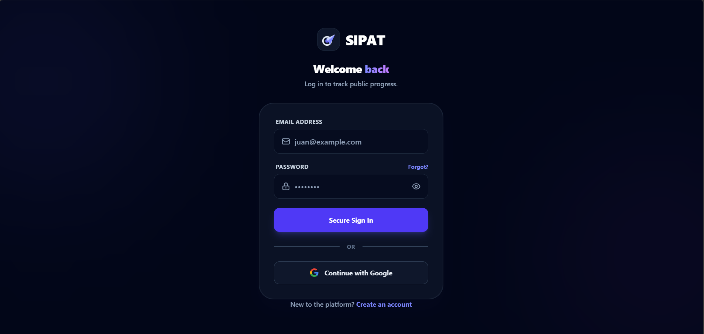

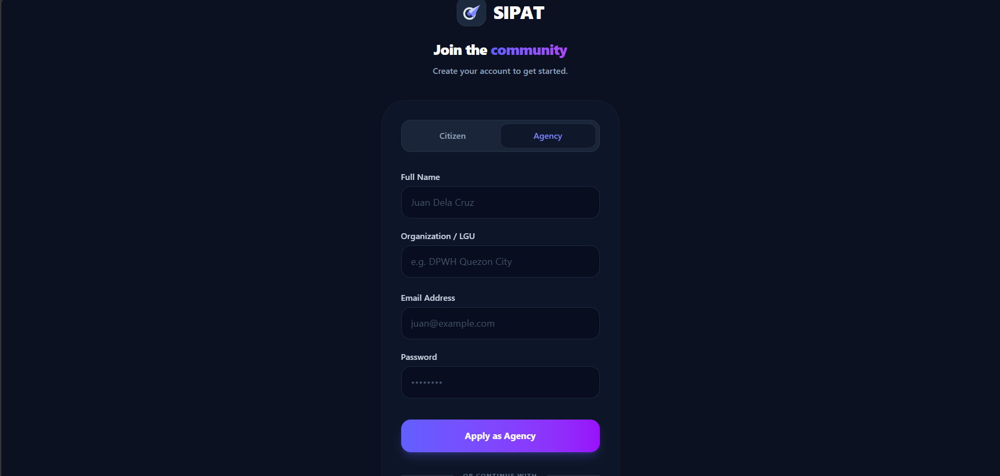

### 🏛️ Admin Dashboard

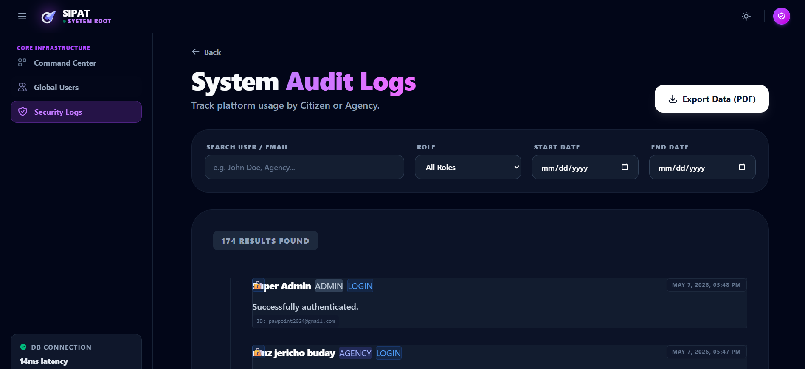
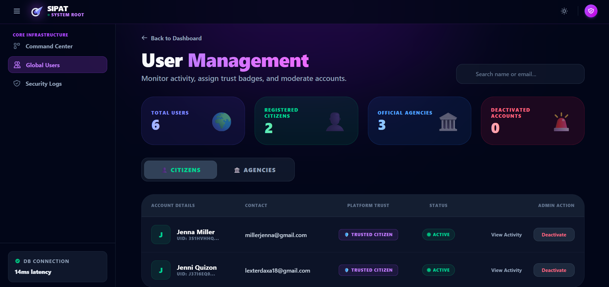
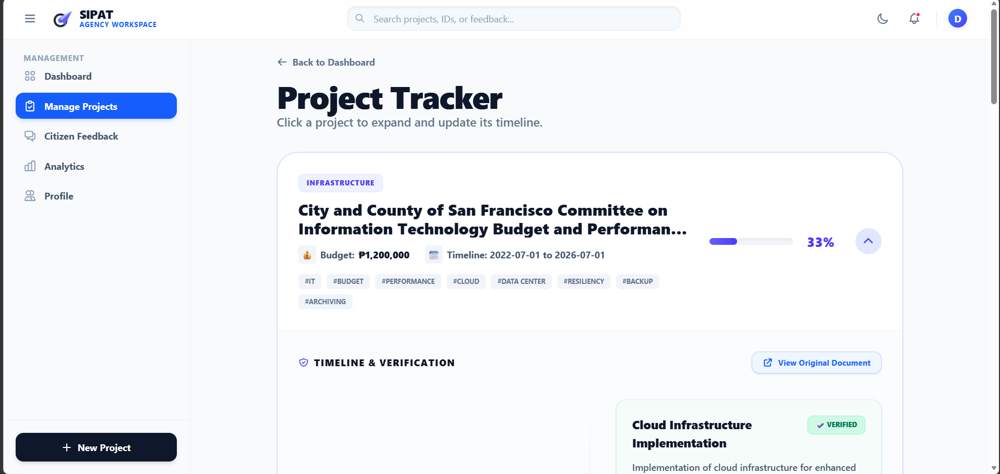

### 🏢 Agency Dashboard

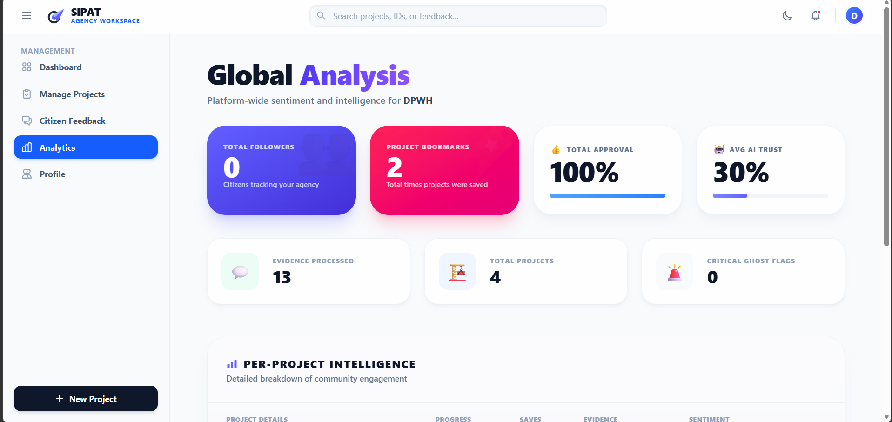
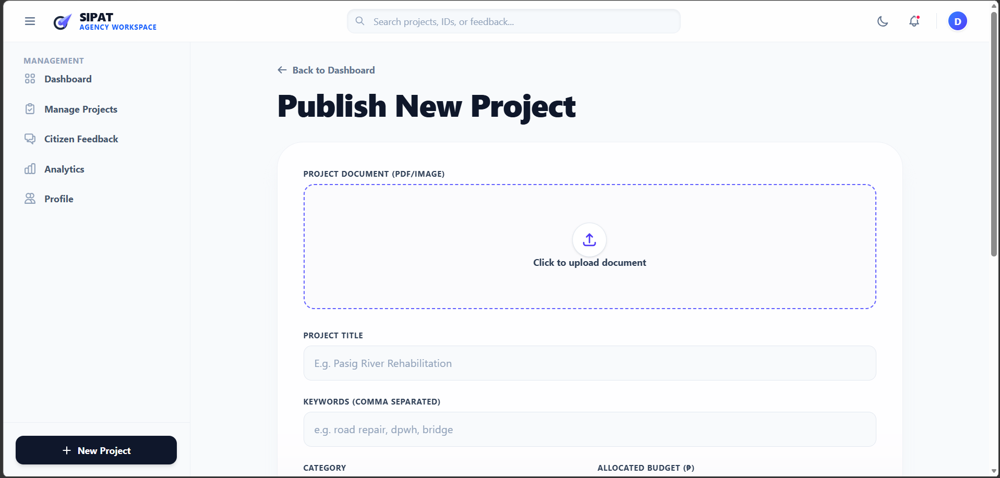
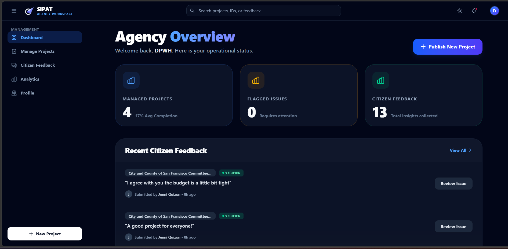
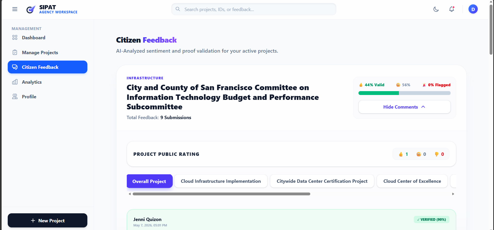
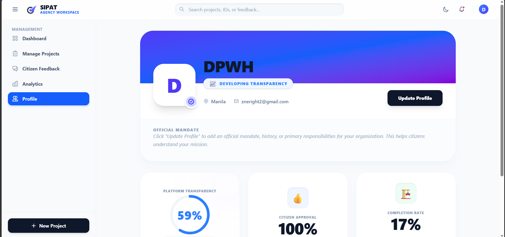

### 📱 Citizen View — Mobile

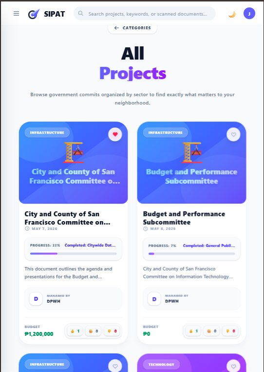
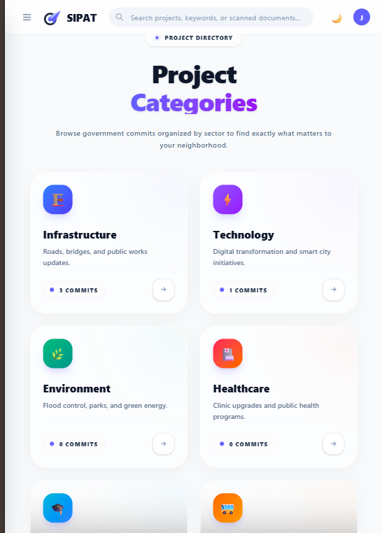
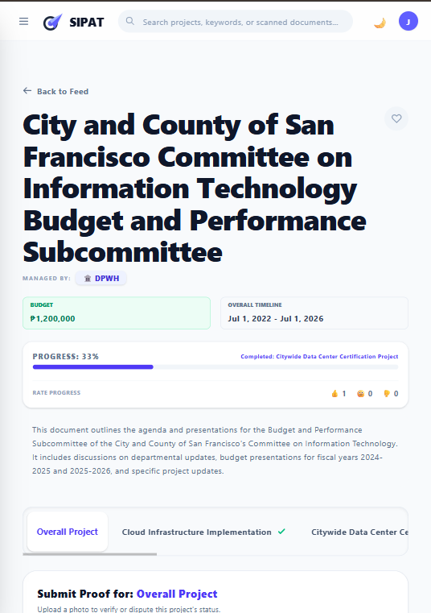
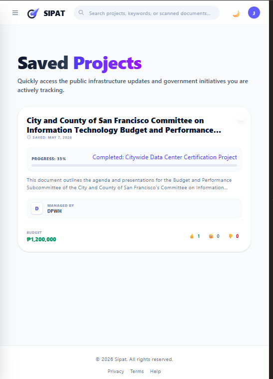
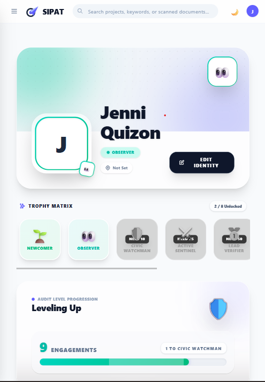

---

## ✨ Core Features

### 🧠 AI-Powered Intelligence — *LuminOS Engine*

Powered by Google Gemini, the LuminOS engine acts as Sipat's core transparency layer — automating audits and validating civic data so citizens don't have to take anyone's word for it.

| Capability | Description |
|---|---|
| 📄 **Smart Document Parsing** | Automatically extracts budget, timeline, category, and construction phases from uploaded agency PDFs and images. |
| 🔍 **Automated Evidence Auditing** | Analyzes citizen-submitted proof (photos + text) and generates a **Match Score (0–100%)** measuring how accurately it reflects official project data. |
| 🚨 **Ghost Project Detection** | Scans community feedback and visual evidence to flag abandoned, fraudulent, or heavily delayed projects with a **🚨 GHOST FLAG**. |
| 🔎 **Semantic Search** | Goes beyond keyword matching — understands the *context* of a citizen's query to surface relevant projects, agencies, and documents. |

---

### 👤 Citizen Portal

Designed to turn passive residents into active civic participants through auditing, engagement, and gamified accountability.

| Feature | Description |
|---|---|
| 📰 **Personalized Commits Feed** | Browse **Trending**, **Recent**, or a **Following** feed aggregating updates from saved agencies and projects. |
| 🕵️ **Active Auditing** | Submit visual and textual proof to update a project's phase status — with full **anonymous submission** support to protect identity. |
| 💬 **Reaction Ecosystem** | Lightweight sentiment system to react to project updates: 👍 Valid · 😐 Neutral · 👎 Flagged. |
| 🏆 **Trophy Matrix** | A leveling system that rewards validated civic engagement. Ranks: **Newcomer 🌱 → Civic Watchman 🛡️ → Lead Verifier 🥇 → Supreme Oracle 👑** |

---

### 🏛️ Agency Command Center

A dedicated workspace for Local Government Units (LGUs) to manage infrastructure portfolios and maintain public trust.

| Feature | Description |
|---|---|
| 📊 **Global Analytics Dashboard** | Real-time metrics: total projects, citizen approval ratings, completion rates, and a calculated **Transparency Score**. |
| 🏗️ **Dynamic Project Management** | Track phase-by-phase progress, manually verify completed milestones, and upload official photo proof. |
| 🔔 **Direct Feedback Monitoring** | Review citizen-submitted evidence, monitor AI trust scores, and identify **Critical Ghost Flags** requiring immediate action. |
| 🪪 **Public Identity & Mandate** | A public-facing agency profile with official mandate, contact details, and earned trust badges (e.g., *Gold Standard Agency*, *Needs Improvement*). |

---

### ⚙️ Super Admin Console

Root-level infrastructure for platform health monitoring and community moderation.

| Feature | Description |
|---|---|
| 🌐 **Global Oversight** | High-level tracking of active citizens, registered agencies, global saves, and total AI verifications across the ecosystem. |
| 👥 **User Management** | Monitor account creation, assign trust badges, and instantly activate or deactivate citizen or agency accounts. |
| 📋 **System Audit Logs** | A rigorous security ledger tracking every major action — logins, searches, registrations, and project creations. |
| 📥 **PDF Report Generation** | Generate and download formatted, localized audit reports with custom branding directly from the platform. |

---

### 🛠️ Platform-Wide Technical Features

- **Role-Based Access Control (RBAC)** — Strict routing and UI rendering based on user role: citizen, agency, or admin.
- **Frictionless Authentication** — Google OAuth + Email/Password login, each mapping directly to a specific platform role.
- **Fluid UI/UX** — Fully responsive layout with dark/light mode toggling and rich micro-interactions powered by **Framer Motion**.
- **Cloud Storage** — Direct uploads to **Cloudinary** for agency documents and citizen photo evidence.

---

## 🎨 Design Philosophy

Sipat was built with a relentless focus on UX/UI, deliberately breaking away from the traditionally clunky "gov-tech" aesthetic.

- **Premium SaaS Aesthetic** — Inspired by Linear and Notion: light-mode-first design, soft slate tones, indigo-blue accent gradients, and deep glassmorphism layering.
- **Dark Mode Support** — A fully-themed dark mode that flips the palette to deep navy and charcoal tones, reducing eye strain without sacrificing visual hierarchy.
- **Micro-Interactions & Motion** — The platform feels *alive* through subtle floating animations, SVG dash-array data lines, pulsating map nodes, and layered radial gradients.
- **Zero-Dependency Visuals** — Complex effects (glowing geographic nodes, animated topographic backgrounds) are executed purely in CSS and inline SVGs, keeping the bundle lightweight and framerates high.
- **Mobile-First & Responsive** — Fully optimized for mobile access, so citizens can monitor projects, check updates, and engage with their community from any device, anywhere.

---

## ⚙️ Tech Stack

| Layer | Technology |
|---|---|
| **Frontend Framework** | React + TypeScript |
| **Styling** | Tailwind CSS v4 (custom keyframes, arbitrary values, background masking) |
| **Animations** | Framer Motion (loading states, tab switching, modal transitions) |
| **Build Tool** | Vite (HMR + optimized production builds) |
| **Backend** | PHP (routing, database, API logic) |
| **AI / ML** | Google AI & Gemini (municipal data processing + accessible summaries) |
| **Auth & DB** | Firebase |
| **File & Media Storage** | Cloudinary (image and file uploads via PHP backend) |

---

## 📁 Project Structure

```
sipat/
├── sipat-frontend/          # React + TypeScript + Vite
│   ├── src/
│   │   ├── components/      # Reusable UI components
│   │   ├── pages/           # Route-level views
│   │   ├── hooks/           # Custom React hooks
│   │   └── lib/             # Utilities and API clients
│   ├── public/
│   └── package.json
│
└── sipat-backend/           # PHP API server
    ├── routes/              # API route definitions
    ├── controllers/         # Business logic
    ├── models/              # Data models
    ├── .env.example
    └── composer.json
```

---

## 🚀 Getting Started

### Prerequisites

- PHP `>=8.1` + Composer
- Node.js `>=18` + npm

### 1. Backend Setup (PHP)

```bash
# Navigate to the backend folder
cd sipat-backend

# Install PHP dependencies
composer install

# Set up your environment file
# NOTE: A pre-filled '.env.txt' file is included in the repo.
# Just rename it to '.env' before running the server.
cp .env.txt .env
# → Your credentials are already inside — no need to fill anything in manually.
# → Includes your CLOUDINARY_CLOUD_NAME, CLOUDINARY_API_KEY, and CLOUDINARY_API_SECRET for file and image uploads.
```

### 2. Frontend Setup (React + Vite)

Open a **new terminal tab** so both servers run simultaneously.

```bash
# Navigate to the frontend folder
cd sipat-frontend

# Install dependencies
npm install

# Install Firebase
npm install firebase

# Start the development server
npm run dev
```

The app will be available at `http://localhost:5173` by default.

### 3. Environment Variables

Create a `.env` file in `sipat-frontend/` and add your Firebase and Google AI credentials:

```env
VITE_FIREBASE_API_KEY=your_key_here
VITE_FIREBASE_AUTH_DOMAIN=your_domain_here
VITE_GOOGLE_AI_API_KEY=your_key_here
```

> ⚠️ **Never commit your `.env` file.** Make sure it's listed in `.gitignore`.

---

## 🌍 Social Impact

Sipat directly addresses three interconnected civic problems:

1. **Accountability** — Contractors and local officials are held to publicly visible timelines and budgets.
2. **Empowerment** — Residents have the data they need to ask informed questions at town halls and community meetings.
3. **Trust** — Transparent, verified reporting actively repairs the trust deficit between citizens and local governance.

> *Transparency isn't just a feature — it's the foundation of a better community.*

---

<div align="center">

Built with ❤️ for DevKada Hackaton 2026.

*Sipat — See Your Community Clearly.*

</div>
